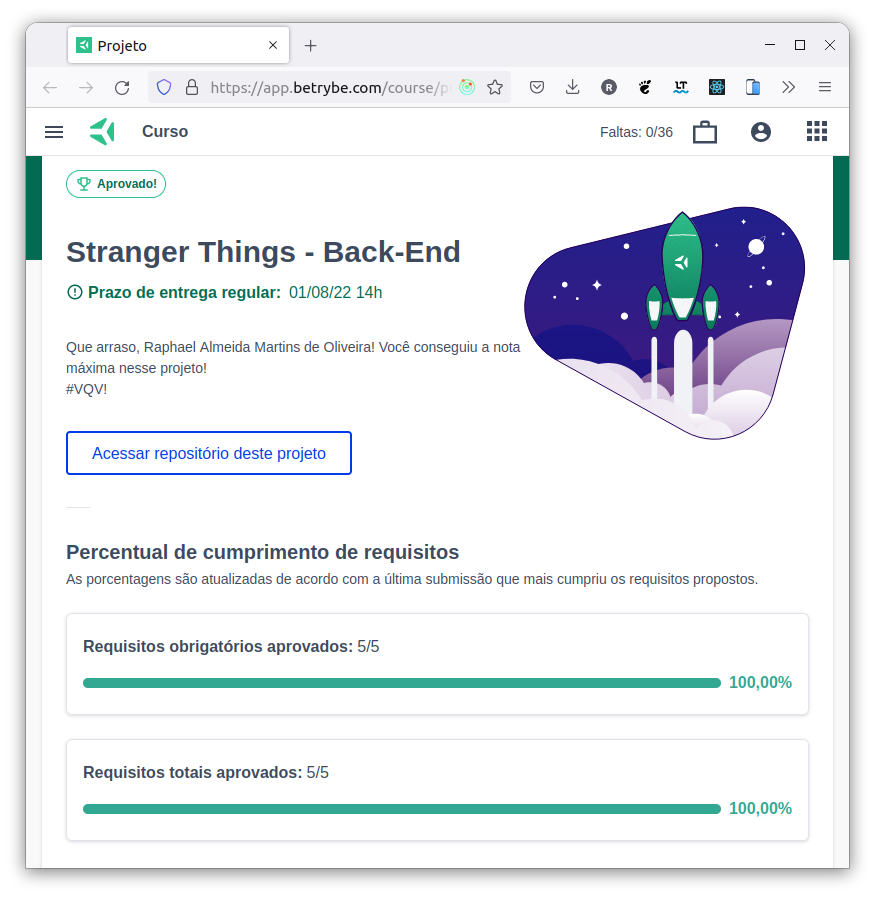

# :alien: Heroku Stranger Things Back-end :flying_saucer:

## :page_with_curl: About/Sobre

  
<strong>:us: English</strong>
 

Heroku deployment project developed by [Raphael Martins](https://www.linkedin.com/in/raphaelameidamartins/) at the end of Unit 25 ([Back-end Development Module](https://github.com/raphaelalmeidamartins/trybe_exercicios/tree/main/3_Desenvolvimento-Back-end)) of Trybe's Web Development course. I was approved with 100% of the mandatory and optional requirements met.

We had to deploy an already existing Back-end application to the Heroku platform by configuring the environment variables and using Docker. The application is not online anymore because I removed after getting approved in the project.
 

  
<strong>:brazil: Português</strong>
 

Projeto de Deploy no Heroku desenvolvido por [Raphael Martins](https://www.linkedin.com/in/raphaelameidamartins/) ao final do Bloco 25 ([Módulo Desenvolvimento Back-end](https://github.com/raphaelalmeidamartins/trybe_exercicios/tree/main/3_Desenvolvimento-Back-end)) do curso de Desenvolvimento Web da Trybe. Fui aprovado com 100% dos requisitos obrigatórios e opcionais atingidos.

Tivemos que fazer o deploy na plataforma Heroku de uma aplicação Back-end que já estava desenvolvida configurando as variáveis de ambiente e utilizando Docker. A aplicação não está mais no ar, pois eu a removi após obter aprovação.
 

## :man_technologist: Developed Skills/Habilidades Desenvolvidas

  
<strong>:us: English</strong>
 

* Configure environment variables and Docker
* Deploy a Back-end application to Heroku
 

  
<strong>:brazil: Português</strong>
 

* Configurar variáveis de ambiente e utilize Docker
* Fazer deploy de uma aplicação Back-end para o Heroku
 

## :hammer_and_wrench: Tools/Ferramentas

* Docker
* Heroku

## :trophy: Grade/Nota

